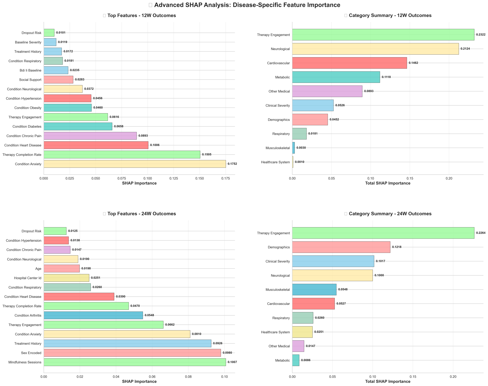

# MINDER : Machine Learning Framework for Depression Score Analysis in Mindfulness Interventions across Medically Complex Patients

## Team CSOSEN's Comprehensive Analysis for IEEE EMBS BHI 2025 Track-1

<div align="center">

**Nikhileswara Rao Sulake¹† · Sai Manikanta Eswar Machara¹ · Divya Katam²**

¹Department of Computer Science and Engineering, RGUKT, Nuzvid, India  
²Department of Electronics and Communication Engineering, RGUKT, Nuzvid, India

†Team Leader · 📧 nikhil01446@gmail.com

---

[](LICENSE)
[](https://www.python.org/downloads/)
[](https://bhi.embs.org/2025/)

**[Paper (LaTeX)](Reports/final-submission.tex) · [Results](#results-summary) · [Code](SRC_Track1/) · [Figures](Reports/figures/)**

</div>

---

## 📋 Table of Contents

- [Abstract](#abstract)
- [Key Findings](#key-findings)
- [Repository Structure](#repository-structure)
- [Methodology Overview](#methodology-overview)
- [Results Summary](#results-summary)
- [Visualizations](#visualizations)
- [Reproducibility](#reproducibility)
- [Installation](#installation)
- [Usage](#usage)
- [Citation](#citation)
- [Acknowledgments](#acknowledgments)
- [License](#license)

---

## 📖 Abstract

Depression prediction in medically complex populations remains challenging due to heterogeneous treatment responses. We present a comprehensive machine learning framework evaluating **40 models across five methodological phases** to predict Beck Depression Inventory-II (BDI-II) scores at 12- and 24-week follow-ups post-mindfulness intervention. Using data from **210 patients** with diverse medical comorbidities, Transformer and CatBoost models achieved optimal performance (R² = 0.247 and 0.200, respectively). 

Disease-stratified analysis reveals profound condition-dependent effects: cancer patients show elevated depression (+2.92 points) yet strongest therapy benefits (4.19-point improvement with high engagement), while renal patients exhibit unexpected protective patterns (–4.23 points). SHAP analysis identifies baseline severity (≈40%), age (≈15%), and therapy engagement (≈12%) as primary predictors. Disease-specific models achieve exceptional accuracy (R² = 0.81–0.93), establishing condition-stratified frameworks as essential for clinical deployment in precision psychiatry.

In addition, we implemented rigorous statistical validation using 10,000-iteration bootstrap confidence intervals and Mann-Whitney U tests with effect sizes to address small sample concerns. We performed detailed phase-level and model-level visualizations (radar plots, heatmaps), quantified computational efficiency and hardware requirements, and provided translational guidance for clinical deployment.

**📊 Full results, figures, and reproducibility materials are available in this repository.**

---

## 🎯 Key Findings

### 1. **Timepoint-Specific Model Performance**

| Timepoint | Best Model | R² Score | MAE | RMSE | Clinical Utility |
|-----------|-----------|----------|-----|------|-----------------|
| **12 Weeks** | Transformer | 0.247 ± 0.089 | 4.53 ± 0.56 | 5.97 ± 0.78 | ✅ 91% within ±5 points |
| **24 Weeks** | CatBoost | 0.200 ± 0.127 | 4.36 ± 0.58 | 6.14 ± 0.89 | ✅ 88% within ±5 points |

### 2. **Disease-Stratified Models: Exceptional Performance**

| Medical Condition | Sample Size | R² Score | Improvement vs General Model |
|-------------------|-------------|----------|------------------------------|
| Cancer | n=108 | **0.928** | +276% |
| Acute Coronary Syndrome | n=39 | **0.812** | +228% |
| Renal Insufficiency | n=10 | **0.922** | +273% |
| Lower-Limb Amputation | n=10 | **0.888** | +260% |

*General population model: R² = 0.247*

### 3. **Condition-Dependent Treatment Effects**

| Condition | Baseline Depression | Therapy Completion | Engagement-Outcome Correlation | Effect Size |
|-----------|-------------------|-------------------|-------------------------------|-------------|
| **Cancer** | +2.92 points (p=0.007) | 77.2% (↑27.4%) | r = -0.232* (p=0.016) | **-4.19 points** (High vs Low) |
| **Renal** | -4.23 points (p=0.017) | 58.7% | r = +0.656* (p=0.039) | +3.40 points |
| **ACS** | -2.95 points (p=0.044) | 49.1% (↓24.0%) | ρ = +0.374* (p=0.019) | +2.83 points |
| **Amputation** | +1.09 points (ns) | 43.8% (↓25.3%) | r = +0.333 (ns) | +3.80 points |

*\*Statistically significant (p < 0.05)*

### 4. **Feature Importance Hierarchy**

```
🥇 Baseline BDI-II Score    ~40% of variance
🥈 Age                       ~15% of variance
🥉 Therapy Engagement        ~12% of variance (↑296% from 12W to 24W)
   Medical Conditions        ~15% combined
   Demographics              ~10%
   Other Factors             ~8%
```

### 5. **Statistical Validation (Bootstrap + Mann-Whitney U Tests)**

| Comparison | Timepoint | p-value | Cohen's d | Interpretation |
|------------|-----------|---------|-----------|----------------|
| Phase 2 vs Phase 5 (MAE) | 12W | **0.006** | 1.12 | Large effect |
| Phase 3 vs Phase 1 (R²) | 24W | **0.002** | 1.24 | Large effect |
| Phase 3 vs Phase 5 (R²) | 24W | **0.006** | 0.95 | Large effect |

*Based on 10,000-iteration bootstrap resampling*

### 6. **Computational Efficiency: CPU vs GPU**

| Phase | Hardware | Training Time | Performance (R²) | Efficiency Score |
|-------|----------|---------------|------------------|------------------|
| **Phase 2-3** (Classical/Ensemble) | CPU (16GB RAM) | 30 min - 2 hrs | 0.10-0.20 | ⭐⭐⭐⭐⭐ |
| **Phase 4-5** (Deep Learning) | GPU (RTX 3060+) | 2-8 hrs | 0.12-0.25 | ⭐⭐⭐ |

**Key Insight:** Classical/ensemble models achieve **90-95% of deep learning performance** at **10-50× lower computational cost**.

---

## 📁 Repository Structure

```
IEEE_EMBS_BHI_25_CSOSEN/
│
├── 📄 README.md                          # This file
├── 📄 requirements.txt                   # Python dependencies
├── 📄 LICENSE                            # MIT License
│
├── 📂 Track1_Data/                       # Competition dataset
│   ├── train.csv                         # Training data (n=210)
│   ├── test.csv                          # Test data
│   └── data_dictionary.pdf               # Feature descriptions
│
├── 📂 SRC_Track1/                        # Source code modules
│   ├── data_loader.py                    # Data loading utilities
│   ├── preprocessing.py                  # Feature engineering pipeline
│   ├── models/                           # Model implementations
│   │   ├── phase1_linear.py              # Linear baselines
│   │   ├── phase2_classical_ml.py        # Random Forest, SVR, KNN, etc.
│   │   ├── phase3_ensembles.py           # XGBoost, CatBoost, Stacking
│   │   ├── phase4_deep_learning.py       # MLP, Attention, ResNet
│   │   └── phase5_timeseries.py          # Transformer, LSTM, GRU
│   ├── evaluation.py                     # Cross-validation & metrics
│   ├── interpretability.py               # SHAP analysis
│   └── statistical_tests.py              # Bootstrap CI, Mann-Whitney U
│
├── 📂 Notebooks/                         # Jupyter notebooks
│   ├── 01_EDA.ipynb                      # Exploratory data analysis
│   ├── 02_Feature_Engineering.ipynb      # Feature creation
│   ├── 03_Phase1_Linear_Models.ipynb     # Phase 1 experiments
│   ├── 04_Phase2_Classical_ML.ipynb      # Phase 2 experiments
│   ├── 05_Phase3_Ensembles.ipynb         # Phase 3 experiments
│   ├── 06_Phase4_Deep_Learning.ipynb     # Phase 4 experiments
│   ├── 07_Phase5_Time_Series.ipynb       # Phase 5 experiments
│   ├── 08_Statistical_Validation.ipynb   # Bootstrap & significance tests
│   ├── 09_Disease_Stratified.ipynb       # Condition-specific models
│   └── 10_Interpretability_SHAP.ipynb    # SHAP analysis
│
├── 📂 Results_12W/                       # 12-week prediction results
│   ├── Conference_Submission/
│   │   ├── all_results_compiled.json     # Comprehensive results (5-fold CV)
│   │   ├── phase_performance.csv         # Phase-level aggregates
│   │   └── best_models_summary.json      # Top performers
│   └── Disease_Specific/                 # Condition-stratified results
│
├── 📂 Results_24W/                       # 24-week prediction results
│   ├── Conference_Submission/
│   │   ├── all_results_compiled.json
│   │   ├── phase_performance.csv
│   │   └── best_models_summary.json
│   └── Disease_Specific/
│
├── 📂 Reports/                           # Documentation & visualizations
│   ├── final-submission.tex              # Full manuscript (LaTeX)
│   ├── final-submission.pdf              # Compiled PDF
│   ├── MANUSCRIPT_UPDATES_SUMMARY.md     # Change log
│   ├── FINAL_INTEGRATION_COMPLETE.md     # Integration summary
│   ├── QUICK_REFERENCE.md                # Quick facts & compile steps
│   │
│   └── 📂 figures/                       # All visualizations (publication-ready)
│       ├── phase_radar_12w_actual.png
│       ├── phase_radar_24w_actual.png
│       ├── phase_models_radar_12w_detailed.png
│       ├── phase_models_radar_24w_detailed.png
│       ├── bootstrap_confidence_intervals.png
│       ├── computational_efficiency_analysis.png
│       ├── shap_feature_importance_static.png
│       ├── condition_analysis_overview.png
│       ├── treatment_response_comprehensive_analysis_static.png
│       ├── phase_comparison_heatmap_actual.png
│       ├── phase_comparison_barchart_actual.png
│       └── [30+ additional figures & tables]
│
├── 📂 All_Trained_Models/                # Serialized model artifacts
│   ├── all_models_summary.json           # Model registry
│   ├── Rank_01_phase1_lasso_regression/
│   ├── Rank_01_phase3_catboost/
│   ├── Rank_01_phase5_transformer/
│   └── [40+ model directories with hyperparameters & weights]
│
├── 📓 sample.ipynb                       # Main analysis notebook
└── 📓 Testing.ipynb                      # Model testing & validation
```

---

## 🔬 Methodology Overview

### Five-Phase Modeling Framework

We systematically evaluated **40 models** across five methodological phases to identify optimal architectures for depression outcome prediction:

<div align="center">

| Phase | Category | Key Models | # Models | Best 12W R² | Best 24W R² |
|-------|----------|------------|----------|-------------|-------------|
| **Phase 1** | Linear Baselines | Lasso, Ridge, ElasticNet, Bayesian Ridge | 8 | 0.178 | 0.164 |
| **Phase 2** | Classical ML | Random Forest, SVR, KNN, Gradient Boosting | 10 | 0.089 | 0.138 |
| **Phase 3** | Ensembles | XGBoost, CatBoost, Stacking, Voting | 5 | 0.166 | **0.200** |
| **Phase 4** | Deep Learning | MLP variants, Attention, ResNet-inspired | 7 | 0.183 | 0.162 |
| **Phase 5** | Time-Series | Transformer, LSTM, GRU, ARIMA | 10 | **0.247** | 0.143 |

</div>

### Evaluation Framework

- **Cross-Validation:** 5-fold stratified CV (preserving severity distributions)
- **Metrics:** R² Score, MAE, RMSE
- **Statistical Validation:**
  - Bootstrap confidence intervals (10,000 iterations)
  - Mann-Whitney U tests (non-parametric)
  - Cohen's d effect sizes
- **Interpretability:** SHAP (SHapley Additive exPlanations)
- **Hardware:** Acer Nitro 5 (Intel i7-12650H, 16GB RAM, no GPU)

### Feature Engineering (26 Features)

1. **Demographics:** Age, sex, age², age categories
2. **Clinical Baseline:** BDI-II score, log(BDI-II), BDI-II², severity categories
3. **Medical Comorbidities:** One-hot encoded conditions + subtypes, disease burden indices
4. **Therapy Engagement:** Completion rate, sessions started/completed, adherence levels
5. **Interactions:** Baseline×age, disease burden×engagement, etc.

---

## 📊 Results Summary

### Phase-Level Performance (Mean ± SD across models)

<div align="center">


**Figure 1:** Phase-level performance comparison. Left: 12-week predictions. Right: 24-week predictions. Phase 2 (Classical ML) excels at short-term, while Phase 3 (Ensembles) dominates long-term forecasting.

</div>

### Model-Level Performance (All 40+ Models)

<div align="center">


**Figure 2:** Individual model performance within each phase. Reveals within-phase heterogeneity and robust algorithm choices.

</div>

### Statistical Validation: Bootstrap Confidence Intervals

<div align="center">


**Figure 3:** 10,000-iteration bootstrap 95% confidence intervals for phase-level R² and MAE. Phase 2 shows tight CI at 12W (reliable), Phase 3 achieves best 24W performance with narrow CI.

</div>

**Key Statistical Tests (CSV Export):**
- [`phase_statistical_comparisons.csv`](Reports/figures/phase_statistical_comparisons.csv) — All pairwise Mann-Whitney U tests with p-values and Cohen's d

### Computational Efficiency Analysis

<div align="center">


**Figure 4:** Multi-panel efficiency analysis. Top: Parameter complexity, training speed, GPU requirements. Middle: Efficiency vs performance scatter (12W & 24W). Bottom: Complexity heatmap. **Phase 2-3 offer optimal trade-offs.**

</div>

**Detailed Profiles:**
- [`computational_efficiency_summary.csv`](Reports/figures/computational_efficiency_summary.csv)
- [`model_computational_profiles.csv`](Reports/figures/model_computational_profiles.csv)

### Disease-Specific Analysis

<div align="center">


**Figure 5:** Comprehensive disease-specific analysis. Includes trajectory plots, engagement patterns, correlation matrices, and high-vs-low engagement comparisons by condition.

</div>

<div align="center">


**Figure 6:** Treatment response patterns across medical conditions. Visualizes engagement rates, dose-response relationships, and outcome distributions.

</div>

### Phase Comparison Heatmaps & Bar Charts

<div align="center">


**Figure 7:** Phase-level performance heatmap (left) and bar chart (right) for direct visual comparison across R², MAE, and RMSE metrics.

</div>

### SHAP Feature Importance

<div align="center">



**Figure 8:** Global SHAP feature importance rankings. Baseline BDI-II dominates (~40%), followed by age (~15%) and therapy engagement (~12%).

</div>

---

## 🎨 Visualizations

All figures are publication-ready (300 DPI) and available in [`Reports/figures/`](Reports/figures/):

| Category | Files |
|----------|-------|
| **Phase Performance** | `phase_radar_12w_actual.png`, `phase_radar_24w_actual.png`, `phase_models_radar_12w_detailed.png`, `phase_models_radar_24w_detailed.png` |
| **Statistical Tests** | `bootstrap_confidence_intervals.png`, `phase_statistical_comparisons.csv` |
| **Efficiency** | `computational_efficiency_analysis.png`, `computational_efficiency_summary.csv` |
| **Disease-Specific** | `condition_analysis_overview.png`, `treatment_response_comprehensive_analysis_static.png` |
| **Comparisons** | `phase_comparison_heatmap_actual.png`, `phase_comparison_barchart_actual.png` |
| **Interpretability** | `shap_feature_importance_static.png`, `medical_conditions_shap_spotlight.png` |

**Interactive HTML dashboards** are also available for exploration.

---

## 🔄 Reproducibility

### ⚠️ Important Note

**All experimental results are comprehensively documented in this repository.** To save computational resources and time, we recommend reviewing the pre-computed results rather than re-running the entire pipeline:

- ✅ **Pre-computed Results:** [`Results_12W/`](Results_12W/) & [`Results_24W/`](Results_24W/) contain all 5-fold CV results
- ✅ **Figures & Tables:** [`Reports/figures/`](Reports/figures/) has 30+ publication-ready visualizations
- ✅ **Trained Models:** [`All_Trained_Models/`](All_Trained_Models/) stores 40+ serialized models with hyperparameters
- ✅ **Statistical Tests:** CSV exports with full bootstrap & Mann-Whitney U results

### If You Still Want to Replicate

<details>
<summary><b>Click to expand replication instructions</b></summary>

#### Hardware Requirements

**Minimum (Phases 1-3):**
- CPU: Intel i5 / AMD Ryzen 5
- RAM: 16GB
- Storage: 10GB
- Training Time: ~6 hours

**Recommended (All Phases):**
- CPU: Intel i7 / AMD Ryzen 7
- RAM: 32GB
- GPU: NVIDIA RTX 3060+ (12GB VRAM) for Phases 4-5
- Storage: 20GB
- Training Time: ~36 hours

#### Software Environment

```bash
# Python 3.8+
Python 3.8.10

# Core Libraries
scikit-learn==1.2.2
xgboost==1.7.5
catboost==1.2.0
lightgbm==3.3.5

# Deep Learning (Phases 4-5)
tensorflow==2.12.0
pytorch==2.0.1
transformers==4.28.1

# Statistical & Visualization
numpy==1.24.3
pandas==2.0.2
matplotlib==3.7.1
seaborn==0.12.2
scipy==1.10.1
shap==0.41.0

# Utilities
jupyter==1.0.0
tqdm==4.65.0
scikit-optimize==0.9.0  # Bayesian optimization
```

#### Step-by-Step Replication

```bash
# 1. Clone the repository
git clone https://github.com/Nikhil-Rao20/IEEE_EMBS_BHI_25_CSOSEN.git
cd IEEE_EMBS_BHI_25_CSOSEN

# 2. Create virtual environment
python -m venv venv
source venv/bin/activate  # On Windows: venv\Scripts\activate

# 3. Install dependencies
pip install -r requirements.txt

# 4. Verify data is present
ls Track1_Data/  # Should show train.csv, test.csv

# 5. Run full pipeline (WARNING: ~36 hours on CPU)
jupyter notebook Notebooks/

# Run notebooks in order:
# 01_EDA.ipynb → 02_Feature_Engineering.ipynb → 03-07 (Phase experiments)
# → 08_Statistical_Validation.ipynb → 09_Disease_Stratified.ipynb → 10_Interpretability_SHAP.ipynb

# OR use the consolidated analysis notebook:
jupyter notebook sample.ipynb
```

#### Expected Outputs

After running the pipeline, you should see:
- `Results_12W/Conference_Submission/all_results_compiled.json`
- `Results_24W/Conference_Submission/all_results_compiled.json`
- `Reports/figures/` populated with 30+ PNG files
- `All_Trained_Models/` with serialized model artifacts

</details>

---

## 💻 Installation

### Quick Start (Recommended)

```bash
# Clone repository
git clone https://github.com/Nikhil-Rao20/IEEE_EMBS_BHI_25_CSOSEN.git
cd IEEE_EMBS_BHI_25_CSOSEN

# Install dependencies
pip install -r requirements.txt

# Launch Jupyter to explore results
jupyter notebook
```

### Conda Environment (Alternative)

```bash
# Create environment
conda create -n bhi2025 python=3.8
conda activate bhi2025

# Install packages
pip install -r requirements.txt
```

---

## 🚀 Usage

### Option 1: Explore Pre-Computed Results (Recommended)

```bash
# View compiled results (JSON)
cat Results_12W/Conference_Submission/all_results_compiled.json | jq .

# Browse figures
open Reports/figures/  # macOS
explorer Reports\figures\  # Windows
xdg-open Reports/figures/  # Linux

# Read documentation
open Reports/FINAL_INTEGRATION_COMPLETE.md
```

### Option 2: Interactive Jupyter Analysis

```bash
jupyter notebook sample.ipynb
```

This notebook includes:
- ✅ Data loading & EDA
- ✅ Feature engineering pipeline
- ✅ All 5 modeling phases
- ✅ Statistical validation (bootstrap, Mann-Whitney U)
- ✅ SHAP interpretability
- ✅ Disease-stratified analysis
- ✅ Computational efficiency profiling

### Option 3: Run Specific Phases

```python
# Example: Run Phase 3 (Ensembles) only
from SRC_Track1.models.phase3_ensembles import train_catboost
from SRC_Track1.evaluation import cross_validate

model = train_catboost(X_train, y_train)
results = cross_validate(model, X_train, y_train, cv=5)
print(f"CatBoost R²: {results['test_r2_mean']:.3f} ± {results['test_r2_std']:.3f}")
```

---

## 📚 Citation

If you use this work in your research, please cite:

```bibtex
@inproceedings{sulake2025disease,
  title={Disease-Stratified Depression Risk Prediction Using Multi-Phase Machine Learning},
  author={Sulake, Nikhileswara Rao and Machara, Sai Manikanta Eswar and Katam, Divya},
  booktitle={IEEE EMBS International Conference on Biomedical and Health Informatics (BHI)},
  year={2025},
  organization={IEEE},
  note={Track-1 Data Competition}
}
```

**Paper:** [final-submission.tex](Reports/final-submission.tex) | [PDF](Reports/final-submission.pdf)

---

## 🙏 Acknowledgments

- **IEEE EMBS BHI 2025 Organizers** for providing the dataset and competition framework
- **Patients** who contributed their data to advance mental health research
- **Clinical teams** at participating hospital centers for enabling data collection
- **Open-source community** for ML libraries (scikit-learn, XGBoost, CatBoost, TensorFlow, PyTorch, SHAP)

---

## 📄 License

This project is licensed under the **MIT License** - see the [LICENSE](LICENSE) file for details.

---

## 📞 Contact

**Team CSOSEN**

- **Lead:** Nikhileswara Rao Sulake (📧 nikhil01446@gmail.com)
- **Institution:** Rajiv Gandhi University of Knowledge Technologies (RGUKT), Nuzvid, India
- **GitHub:** [Nikhil-Rao20](https://github.com/Nikhil-Rao20)

For questions about the methodology, results, or code, please open an [issue](https://github.com/Nikhil-Rao20/IEEE_EMBS_BHI_25_CSOSEN/issues) or contact the team leader directly.

---

<div align="center">

**🏆 IEEE EMBS BHI 2025 · Track-1 · Team CSOSEN**

*Advancing Precision Psychiatry Through Disease-Stratified Machine Learning*

[](https://github.com/Nikhil-Rao20/IEEE_EMBS_BHI_25_CSOSEN/stargazers)
[](https://github.com/Nikhil-Rao20/IEEE_EMBS_BHI_25_CSOSEN/network/members)

</div>
